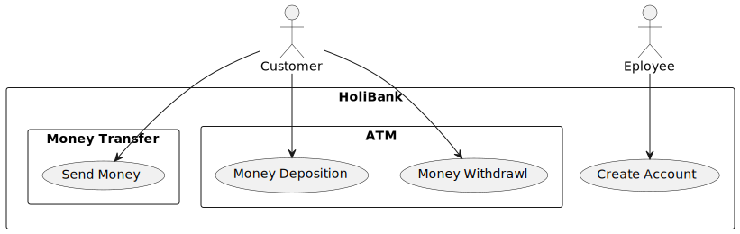
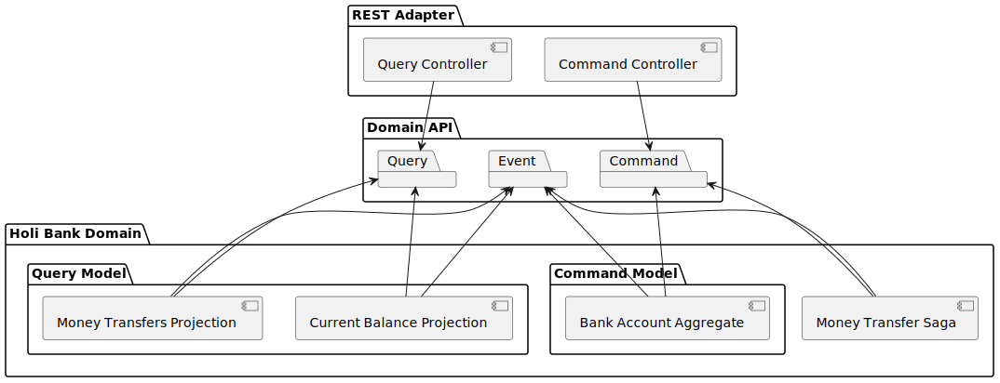
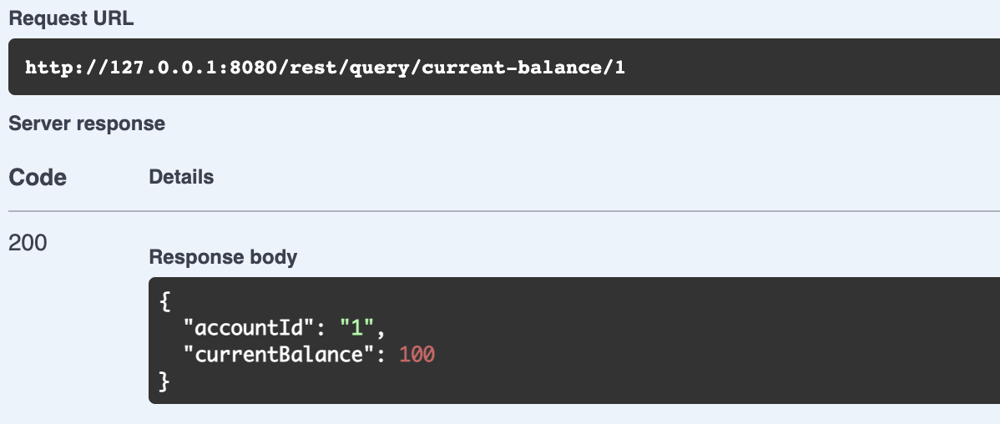
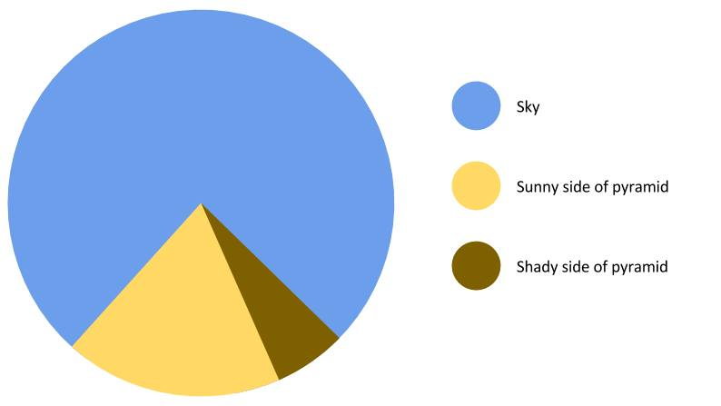
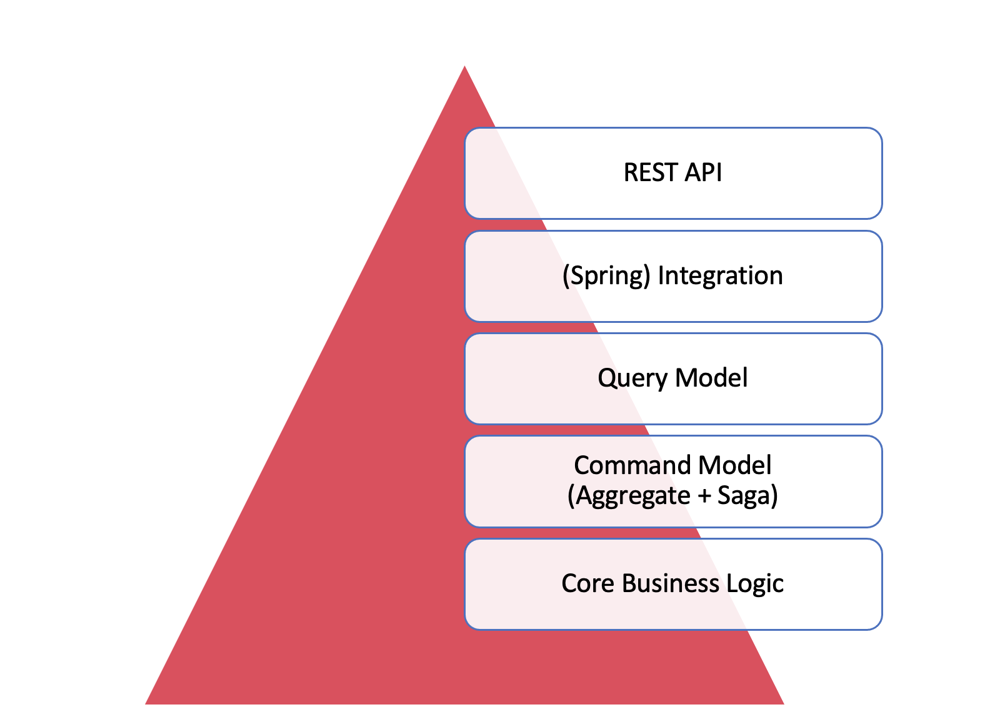
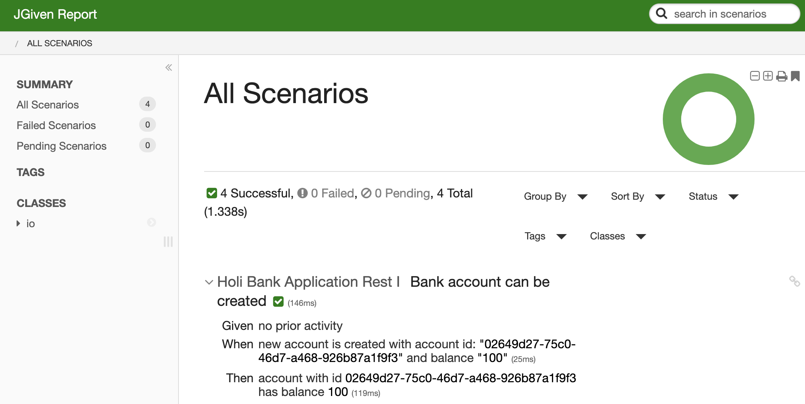

 <!-- .element: style="width: 40%" -->

 <!-- .element: style="width: 40%" -->

# Axon Testing Workshop

<!-- .slide: class="title" data-background="images/brand/title_white_footer.png" data-background-repeat="repeat-x" data-background-position="bottom center" data-background-size="inherit" -->

---

# Hands-on?

* This is an interactive workshop
* Let's code together
* You will need:
  * Java 17
  * git
  * IDE
  * Docker
  * Code: https://github.com/holixon/workshop-axon-testing/

---

# Example Domain: HoliBank

The HoliBank is a very simple banking service.

<!-- .element: style="height: 500px; padding-bottom:10px;" -->

--

# Component Diagram

<!-- .element: style="height: 500px; padding-bottom:10px;" -->

--

# Demo

<!-- .element: style="height: 500px; padding-bottom:10px;" -->

---

# The Testing Pyramid

 <!-- .element: style="height: 500px; padding-bottom:10px;" -->

--

# The Testing Pyramid for HoliBank

 <!-- .element: style="height: 500px; padding-bottom:10px;" -->

--

## Roadmap Today

* Testing concepts
* Unit Testing with Fixtures
  * Aggregates
  * Sagas
* Behaviour-Driven Testing with JGiven Axon Extension
* Integration Testing with Spring Boot
* Black Box Testing with Spring Boot & Test Containers

---

# Testing Concepts

--

## Testing Concepts: Unit Testing

* System under Test (SUT): individual component
* Execute (one) action on SUT
* Assert **State**
* White Box testing
* Mock / Emulate Environment

--

## Testing Concepts: Behavior Testing

* SUT: One component with behaviour, multiple components
* Execute multiple actions on System under Test (SUT)
* Assert SUT to show **behaviour** in reacting to actions
* White / Black Box testing
* Mock / Use real Environment

---

# Domain Logic Test

* SUT: Domain Core Types
* What to test:
  * Calculations are correct
  * Type constraints are met
* Tools: junit
* Hints: Use **Strong** Type System (e.g. Kotlin), Bean Validation

---

# Command Model Test

* SUT: Aggregates, Command Handlers
* What to test:
  * Correct aggregate **state**
  * Correct **behavior** (reacting on commands)
* Limitations: multiple classes in combination
* Tools: junit with Axon Test Fixtures

--

## Approach

* Use JUnit as runner
* Test one class
* Use Fixtures provided by Axon Framework

--

## Class 1 - Test BankAccountAggregate

* Check out: `git checkout class/0-prepare`
* Open `BankAccountAggregateTest`
* Implement test to create a new `BankAccount` using `AggregateTestFixture`

---

# Testing with JGiven

* FOSS framework for BDD testing for JVM
* Fluent scenario tests with `GIVEN`/`WHEN`/`THEN`
* Separation of test code from application driver code
* Smart state transfer beween stages with `@ScenarioState`
* Produces business-readable reports

--

# JGiven Report

<!-- .element: style="height: 500px; padding-bottom:10px;" -->

--

## JGiven Axon Extension

* Usage of JGiven with special **Axon Stages**
* Testing of Aggregates, Sagas
* Limitations: same as by unit

---

# Saga Test

* SUT: Sagas
* What to test:
  * Correct **behavior** (reacting on events)
  * Saga serialization

--

## Approach

* Use Axon JGiven Extension
* Use junit for serialization/deserialization testing

---

# Query Model Test

* SUT: Query model
* What to test:
  * Correct query response for query model filled by events
* Limitations:
  * Assuming correct event stream
  * Assuming correct query dispatch

--
## Approach

* Use JGiven as driver
* Call event handlers manually from JGiven stage
* Assert query response by invoking query methods

--

## Class 2: Test CurrentBalanceProjection

* Check out: `git checkout class/2-query-model`
* Open `CurrentBalanceProjectionTest`
* Check the `CurrentBalanceActionStage` and `CurrentBalanceAssertStage`
* Implement test to check balance of:
  * newly created account
  * account after money deposit
  * account after money transfer

---

# Spring Integration Test

--

## Limitations so far

* Components tested in isolation
* Assumed correct behaviour of interactions for scenarios
* Assumed correct dispatching of queries
* Most behaviours have only few states

<!-- .element: style="height: 300px; padding-bottom:10px; padding-left: 800px;" -->

--

## Testing command and query model integration

* SUT: Query and Command Model
* What to test:
  * Use cases using domain API (commands and queries)
* Limitations:
  * no serialization
  * in-memory buses
  * long duration
--

## Approach

* Setup Spring Boot Test
* Setup Spring Configuration
  * In-Memory Buses
  * In-Memory EventStore
  * In-Memory TokenStore
* Use JGiven
* Use Awaitility if you need to wait

--

# Class 3: Test domain integration of model

* Check out: `git checkout class/3-integration`
* Open `BankAccountUseCasesSpringITest`
* Check the `BankAccountActionStage` and `BankAccountAssertStage`
* Check `TestConfiguration`
* Implement test for use cases:
  * create account
  * withdraw money
  * transfer money

---

# Spring Boot Test with TestContainers

--

## What is not covered yet?

* Usage in real environment (e.g. Axon Server)
* Test of REST adapter

--

## Black-box E2E test

* SUT: Entire System via REST
* What to test:
  * (Observed) System behaviour within real environment
* Limitations:
  * complex setup
  * long duration

--

## Approach

* Spring Boot Test
* Axon Server in TestContainer
* Use JGiven
* Use MockMVC for REST driver
* Use Awaitility
* Use JSON Assert

--

## Class 4: E2E SpringBoot Mock MVC with TestContainer

* Check out: `git checkout class/4-rest-e2e`
* Open `HoliBankApplicationRestITest`
* Check the `HoliBankApplicationActionStage` and `HoliBankApplicationAssertStage`
* Check `AbstractTestContainerIntegrationTestBase`
* Implement test for use cases:
  * create account
  * withdraw money
  * transfer money

---

# Outlook and Hints

* We could test architecture (ArchUnit)
* We could test performance (scale-out command and query model)
* We should have used Kotlin (better type system, Kotlin Extension)
* We were looking on one Bounded Context (check our talk tomorrow)

---

# References

* JGiven: https://www.jgiven.org/
* JGiven Axon: https://github.com/holixon/axon-testing/
* Awaitility: https://awaitility.org/
* HoliBank Code: https://github.com/holixon/workshop-axon-testing/
* Jan: https://about.me/jangalinski
* Simon: https://about.me/zambrovski
